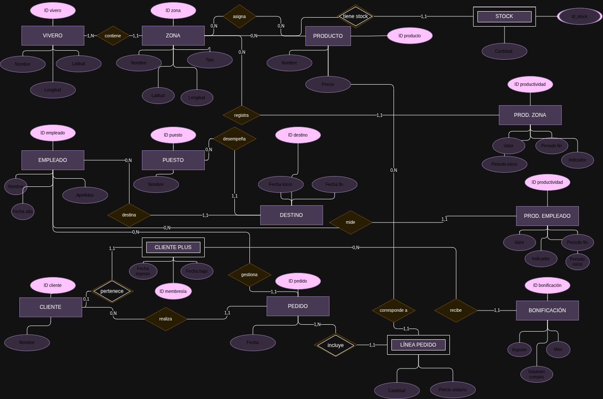

# P2_ADBD
## P2 - Modelo entidad/relación. Viveros
### 1. Imagen del modelo entidad/relación del escenario descrito

### 1-* IMAGEN CON MODIFICACION

### 2. Descripción de cada una de las entidades definidas.
- **Vivero** - Representa cada establecimiento de la empresa.
- **Zona** - Representa una zona específica dentro de un vivero.
- **Producto** - Representa un producto de la empresa
- **Stock** - Es una entidad asociativa entre Zona y Producto, para indicar cuanta cantidad de ese producto hay disponible en una zona concreta.

- **Empleado** - Un trabajador de la empresa.
- **Puesto** - Tipo de puesto que puede desempeñar un empleado.
- **Destino** - Histórico de donde trabaja un empleado y con que puesto.

- **Productividad_zona** - Registra indicadores de productividad de una zona a lo largo del tiempo.
- **Productividad_empleado** - Registra indicadores de productividad de un empleado a lo largo del tiempo.

- **Cliente** - Representa a un cliente de Tajinaste S.A.
- **ClientePlus** - Representa un cliente del programa de fidelizacioón
- **Pedido** - Representa una compra de un cliente de la fidelización Tajinaste Plus.
- **Linea_pedido** - Representa cada producto incluido en un pedido.
- **Bonificación** - Representa la bonificación asignada a un cliente Plus para un mes.

### 3. Descripción y ejemplos ilustrativos del dominio de cada uno de los atributos de las entidades y de las relaciones.
#### VIVERO
- id_vivero → Identificador entero positivo **PRIMARY KEY**
- nombre → Texto
- latitud → Número decimal 
- longitud → Número decimal 
#### ZONA
- id_zona → Identificador entero positivo **PRIMARY KEY**
- nombre → Texto
- tipo → Texto
- latitud → Número decimal 
- longitud → Número decimal
- id_vivero → Vivero al que pertenece la zona **FOREIGN KEY**
#### PRODUCTO
- id_producto → Identificador entero positivo **PRIMARY KEY**
- nombre → Texto
- precio → Número decimal no negativo con dos decimales
#### STOCK
- id_zona → Zona donde está el stock **FOREIGN KEY**
- id_producto → Producto almacenado **FOREIGN KEY**
- cantidad → Número entero positivo
#### EMPLEADO
- id_empleado → Identificador entero positivo **PRIMARY KEY**
- nombre → Texto
- apellidos → Texto
- fecha_alta → Fecha de incorporación
#### PUESTO
- id_puesto → Identificador entero positivo **PRIMARY KEY**
- nombre → Texto
#### DESTINO
- id_destino → Identificador entero positivo **PRIMARY KEY**
- fecha_inicio → Fecha de incorporación
- fecha_fin → Fecha de finalizacion
- id_empleado → Empleado destinado **FOREIGN KEY**
- id_zona → Zona de destino **FOREIGN KEY**
- id_puesto → Puesto que se va a desempeñar **FOREIGN KEY**
#### PRODUCTIVIDAD_ZONA
- id_productividad → Identificador para medir la productividad **PRIMARY KEY**
- periodo_inicio → Fecha de inicio para medir
- periodo_fin → Fecha de fin de la medición
- valor → Número entero
- id_zona → Zona medida **FOREIGN KEY**
#### PRODUCTIVIDAD_EMPLEADO
- id_productividad → Identificador para medir la productividad **PRIMARY KEY**
- periodo_inicio → Fecha de inicio para medir
- periodo_fin → Fecha de fin de la medición
- valor → Número entero
- id_empleado → Empleado al que evaluamos su productividad **FOREIGN KEY**
#### CLIENTE
- id_cliente → Identificador entero positivo **PRIMARY KEY**
- nombre → Texto
#### CLIENTEPLUS
- id_membresia → Identificador entero positivo **PRIMARY KEY**
- fecha_ingreso → Fecha de incorporación
- fecha_baja → Fecha de finalización
#### PEDIDO
- id_pedido → Identificador entero positivo **PRIMARY KEY**
- fecha → Fecha en la que se realiza el pedido
- id_cliente → Cliente Plus que realiza el pedido **FOREIGN KEY**
- id_empleado → Empleado que tramita el pedido **FOREIGN KEY**
#### LINEA_PEDIDO
- id_pedido → Identificador entero positivo **PRIMARY KEY** **FOREIGN KEY**
- id_producto → Identificador entero positivo **PRIMARY KEY** **FOREIGN KEY**
- cantidad → Cantidad solicitada, número entero mayor que 0
- precio_unitario → precio del producto en ese pedido
#### BONIFICACIÓN
- id_bonificacion → Identificador entero positivo **PRIMARY KEY**
- mes → Texto
- volumen_compras → Número entero positivo que ha realizado el cliente
- impporte_bonificación → Número decimal no negativo con dos decimales
- id_cliente → Cliente Plus que tiene la bonificación **FOREIGN KEY**

### 4 . Descripción de cada una de las relaciones definidas. Describa con detalle la cardinalidad de cada relación.
VIVERO — ZONA
- Un VIVERO tiene 1-N ZONAS.
- Una ZONA pertenece a 1 y solo 1 VIVERO.
- Ejemplo: el vivero Vivero La Orotava puede tener las zonas Exterior, Almacén e Invernadero 1.

ZONA — PRODUCTO mediante STOCK
- Una ZONA puede contener 0-N productos.
- Un PRODUCTO puede estar asignado a 0-N zonas.
- STOCK registra la cantidad disponible para cada pareja zona-producto.
- Ejemplo: en Almacén puede haber 40 unidades de Ficus, mientras que en Exterior puede haber 15.

EMPLEADO — DESTINO
- Un EMPLEADO puede tener 0-N destinos históricos.
- Cada DESTINO pertenece a 1 empleado.
- Los destinos tienen fechas para reconstruir el histórico.

ZONA — DESTINO
- Una ZONA puede tener 0-N destinos a lo largo del tiempo.
- Cada DESTINO se realiza en 1 zona.
- Como una zona pertenece a un vivero, el destino determina indirectamente el vivero.

PUESTO — DESTINO
- Un PUESTO puede aparecer en 0-N destinos.
- Cada DESTINO tiene 1 puesto.
- Ejemplo: Vendedor puede ser desempeñado por muchos empleados y en distintos periodos.

ZONA — PRODUCTIVIDAD_ZONA
- Una zona puede tener 0..N mediciones de productividad.
- Cada medición corresponde a 1 zona.
- La existencia de periodo permite comparar la productividad a lo largo del tiempo.

EMPLEADO — PRODUCTIVIDAD_EMPLEADO
- Un empleado puede tener 0..N mediciones.
- Cada medición corresponde a 1 empleado.
- Ejemplo: ventas gestionadas por empleado durante cada mes.

CLIENTE - CLIENTEPLUS
- Un cliente puede no pertenecer al programa o pertenecer a él: 0..1.
- Cada registro de TAJINASTE_PLUS corresponde a 1 cliente.
- Se almacenan las fechas de ingreso y, si existe, de baja.

CLIENTE — PEDIDO
- Un cliente puede realizar 0..N pedidos.
- Cada pedido pertenece a 1 y solo 1 cliente.

EMPLEADO — PEDIDO
- Un empleado puede gestionar 0..N pedidos.
- Cada pedido tiene exactamente 1 empleado responsable.
- No se permite que un pedido tenga dos responsables.

PEDIDO — LINEA_PEDIDO
- Un pedido tiene 1..N líneas.
- Cada línea pertenece a 1 pedido.
- Un pedido de dos productos tendrá dos líneas.

PRODUCTO — LINEA_PEDIDO
- Un producto puede aparecer en 0..N líneas de pedido.
- Cada línea se refiere a 1 producto.

CLIENTEPLUS — BONIFICACION
- Un miembro Plus puede tener 0..N bonificaciones.
- Cada bonificación pertenece a 1 miembro Plus.
- Debe existir como máximo una bonificación para cada combinación (cliente, mes).

### 5 . Restricciones semánticas propuestas.
- No solapamiento de destinos: un empleado no puede tener dos destinos cuyas fechas se solapen. Esto implementa la condición de que nunca tiene dos destinos a la vez.  

- Destino siempre en una zona: todo destino debe indicar exactamente una zona. No se permite asignar un empleado solamente al vivero sin especificar zona.

- Coherencia vivero-zona: una zona pertenece a un único vivero.

- Fechas de destino válidas: fecha_inicio < fecha_fin cuando exista fecha_fin. Una fecha de fin NULL representa un destino actual

- Stock no negativo: cantidad_disponible >= 0.

- Unicidad del stock: no puede existir más de un registro para la misma (zona, producto).

- Pedido con responsable único: id_empleado de PEDIDO es obligatorio y cada pedido tiene un responsable.

- Bonificación mensual única: un cliente Plus no puede tener dos registros de bonificación para el mes. Restricción de: (id_cliente, mes).

- Coherencia de la bonificación: volumen_compra debería calcularse a partir de los pedidos del cliente durante ese mes, y importe_bonificacion según las reglas del programa.

- Líneas válidas: cantidad > 0 y precio_unitario >= 0.

- Periodo de productividad válido: periodo_inicio < periodo_fin. No debería haber dos mediciones duplicadas para el mismo objeto, indicador y periodo.
